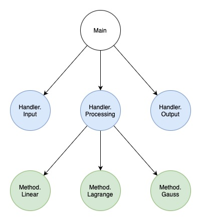
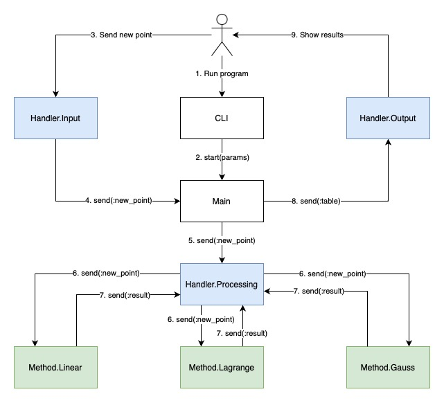

# Лабораторная работа №3

## Цель работы

Получить навыки работы с вводом/выводом, потоковой обработкой данных, командной строкой.

## Задание

В рамках лабораторной работы вам предлагается повторно реализовать лабораторную работу по предмету "Вычислительная математика" посвящённую аппроксимации (в разные годы это лабораторная работа 3 или 4) со следующими дополнениями:

- обязательно должна быть реализована линейная интерполяция (отрезками, [link](https://en.wikipedia.org/wiki/Linear_interpolation));
- настройки алгоритма аппроксимирования и выводимых данных должны задаваться через аргументы командной строки:
  - какие алгоритмы использовать (в том числе два сразу);
  - частота дискретизации результирующих данных;
  - и т.п.;
- входные данные должны задаваться в текстовом формате на подобии ".csv" (к примеру `x;y\n` или `x\ty\n`) и подаваться на стандартный ввод, входные данные должны быть отсортированы по возрастанию x;
- выходные данные должны подаваться на стандартный вывод;
- программа должна работать в потоковом режиме (пример -- `cat | grep 11`), это значит, что при запуске программы она должна ожидать получения данных на стандартный ввод, и, по мере получения достаточного количества данных, должна выводить рассчитанные точки в стандартный вывод;

## Общие требования

- программа должна быть реализована в функциональном стиле;
- ввод/вывод должен быть отделён от алгоритмов аппроксимации;
- требуется использовать идиоматичный для технологии стиль программирования.

## Выполнение

### Дерево процессов



### Работа программы



### Реализация

- [Работа с командной строкой](./lib/cli.ex)
- [Основной цикл работы программы](./lib/main.ex)
- Обработчики
  - [Обработчик входных данных](./lib/handlers/input.ex)
  - [Обработчик выходных данных](./lib/handlers/output.ex)
  - [Обработчик точек](./lib/handlers/processing.ex)
- Методы интерполяции
  - [Линейная интерполяция](./lib/methods/linear.ex)
  - [Метод Гаусса](./lib/methods/gauss.ex)
  - [Метод Лагранжа](./lib/methods/lagrange.ex)
- Прочее
  - [Матрица](./lib/matrix.ex)
  - [Работа с окном и прочее](./lib/utils.ex)

### Пример работы

#### Интерактивная обработка

```
$ ./interpolation -f 0.2 -w 5 linear lagrange gauss            
1 2
2 3
"Linear interpolation"
1.00    1.20    1.40    1.60    1.80    2.00    2.20
2.00    2.20    2.40    2.60    2.80    3.00    3.20
3 4.5
"Linear interpolation"
2.00    2.20    2.40    2.60    2.80    3.00
3.00    3.30    3.60    3.90    4.20    4.50
4 5
"Linear interpolation"
3.00    3.20    3.40    3.60    3.80    4.00
4.50    4.60    4.70    4.80    4.90    5.00
5 5.2
"Linear interpolation"
4.00    4.20    4.40    4.60    4.80    5.00
5.00    5.04    5.08    5.12    5.16    5.20
"Lagrange interpolation"
1.00    1.20    1.40    1.60    1.80    2.00    2.20    2.40    2.60    2.80    3.00    3.20    3.40    3.60    3.80    4.00    4.20    4.40    4.60    4.80    5.00
2.00    2.01    2.15    2.38    2.67    3.00    3.34    3.67    3.99    4.26    4.50    4.69    4.83    4.92    4.98    5.00    5.00    5.00    5.02    5.08    5.20
"Gauss interpolation"
1.00    1.20    1.40    1.60    1.80    2.00    2.20    2.40    2.60    2.80    3.00    3.20    3.40    3.60    3.80    4.00    4.20    4.40    4.60    4.80    5.00
2.00    2.01    2.15    2.38    2.67    3.00    3.34    3.67    3.99    4.26    4.50    4.69    4.83    4.92    4.98    5.00    5.00    5.00    5.02    5.08    5.20
6 6.1
"Linear interpolation"
5.00    5.20    5.40    5.60    5.80    6.00
5.20    5.38    5.56    5.74    5.92    6.10
"Lagrange interpolation"
2.00    2.20    2.40    2.60    2.80    3.00    3.20    3.40    3.60    3.80    4.00    4.20    4.40    4.60    4.80    5.00    5.20    5.40    5.60    5.80    6.00
3.00    3.40    3.75    4.05    4.30    4.50    4.66    4.79    4.88    4.95    5.00    5.04    5.07    5.10    5.14    5.20    5.29    5.41    5.58    5.81    6.10
"Gauss interpolation"
2.00    2.20    2.40    2.60    2.80    3.00    3.20    3.40    3.60    3.80    4.00    4.20    4.40    4.60    4.80    5.00    5.20    5.40    5.60    5.80    6.00
3.00    3.40    3.75    4.05    4.30    4.50    4.66    4.79    4.88    4.95    5.00    5.04    5.07    5.10    5.14    5.20    5.29    5.41    5.58    5.81    6.10
6.5 7
"Linear interpolation"
6.00    6.20    6.40    6.60
6.10    6.46    6.82    7.18
"Lagrange interpolation"
3.00    3.20    3.40    3.60    3.80    4.00    4.20    4.40    4.60    4.80    5.00    5.20    5.40    5.60    5.80    6.00    6.20    6.40    6.60
4.50    4.69    4.82    4.91    4.96    5.00    5.03    5.05    5.08    5.13    5.20    5.30    5.44    5.61    5.83    6.10    6.42    6.79    7.22
"Gauss interpolation"
3.00    3.20    3.40    3.60    3.80    4.00    4.20    4.40    4.60    4.80    5.00    5.20    5.40    5.60    5.80    6.00    6.20    6.40    6.60
4.50    4.73    4.87    4.95    4.99    5.00    5.01    5.02    5.05    5.11    5.20    5.32    5.48    5.66    5.87    6.10    6.33    6.56    6.76
7 8.9
"Linear interpolation"
6.50    6.70    6.90    7.10
7.00    7.76    8.52    9.28
"Lagrange interpolation"
4.00    4.20    4.40    4.60    4.80    5.00    5.20    5.40    5.60    5.80    6.00    6.20    6.40    6.60    6.80    7.00
5.00    4.88    4.87    4.94    5.06    5.20    5.35    5.52    5.69    5.88    6.10    6.39    6.76    7.28    7.97    8.90
"Gauss interpolation"
4.00    4.20    4.40    4.60    4.80    5.00    5.20    5.40    5.60    5.80    6.00    6.20    6.40    6.60    6.80    7.00
5.00    4.89    4.88    4.94    5.05    5.20    5.37    5.55    5.74    5.92    6.10    6.27    6.44    6.61    6.80    7.00
^D
```

#### Конвейерная обработка

```
$ ./interpolation -f 1 -w 6 gauss < input.txt      
"Gauss interpolation"
1.00    2.00    3.00    4.00    5.00    6.00    7.00    8.00    9.00    10.00
-722.59 -474.00 -244.81 -77.00  16.47   44.00   27.75   -4.00   -24.47  -16.00
"Gauss interpolation"
3.00    4.00    5.00    6.00    7.00    8.00    9.00    10.00   11.00   12.00   13.00
-3750.00        385.00  1064.00 580.00  90.00   -55.00  20.00   44.00   -70.00  105.00  1840.00
"Gauss interpolation"
4.00    5.00    6.00    7.00    8.00    9.00    10.00   11.00   12.00   13.00   14.00
33.88   59.05   66.00   58.37   40.50   17.13   -7.00   -27.43  -40.38  -43.05  -34.00
"Gauss interpolation"
8.00    9.00    10.00   11.00   12.00   13.00   14.00   15.00   16.00   17.00   18.00   19.00
-202.41 366.16  181.72  -7.72   -18.16  34.41   -2.03   -51.47  454.09  2838.66 9446.22 23904.78
"Gauss interpolation"
9.00    10.00   11.00   12.00   13.00   14.00   15.00   16.00   17.00   18.00   19.00   20.00
1300.00 194.00  -52.00  -25.00  12.00   6.00    0.00    19.00   -44.00  -542.00 -2188.00        -6169.00
```

#### Потоковая обработка

```
$ cat | ./interpolation -f 1 linear gauss           
1 10
2 17
"Linear interpolation"
1.00    2.00
10.00   17.00
5 20
"Linear interpolation"
2.00    3.00    4.00    5.00
17.00   18.00   19.00   20.00
^D
```

## Выводы

Приятно удивила работа с процессами в Elixir. Очень удобно взаимодействовать между процессами посредством обмена сообщениями. Пока искал информацию в интернете по конкурентности, увидел, что в этом языке из коробки идут очень много мощных инструментов, которые позволяют разрабатывать сложные распределенные системы.

Что касается вычислительной математики, то мне не особо понравилось. Если с методом Лагранжа и отрезков все хорошо, то когда дело доходит до работы с матрицами или вложенными циклами, начинается мессиво. Вот пример:

Реализация на языке Python

```python
def gauss_polynomial(dots, x):
    n = len(dots)
    y = [[0 for _ in range(n)] for __ in range(n)]
    for k in range(n):
        y[k][0] = dots[k][1]

    for i in range(1, n):
        for j in range(n - 1):
            y[j][i] = y[j + 1][i - 1] - y[j][i - 1]

    result = y[n // 2][0]
    t = (x - dots[n // 2][0]) / (dots[1][0] - dots[0][0])
    for i in range(1, n):
        result += gauss_t(t, i) * y[(n - i) // 2][i] / factorial(i)

    return result
```

Реализация на языке Elixir

```elixir
defp gauss_polynomial(points, x) do
  n = length(points)

  matrix =
    Enum.reduce(0..(n - 1), Matrix.new(n, n), fn i, acc ->
      Matrix.set(acc, i, 0, get_y(points, i))
    end)

  matrix =
    Enum.reduce(1..(n - 1), matrix, fn i, i_acc ->
      Enum.reduce(0..(n - 2), i_acc, fn j, j_acc ->
        Matrix.set(j_acc, j, i, Matrix.elem(j_acc, j + 1, i - 1) - Matrix.elem(j_acc, j, i - 1))
      end)
    end)

  base = Matrix.elem(matrix, div(n, 2), 0)
  t = (x - get_x(points, div(n, 2))) / (get_x(points, 1) - get_x(points, 0))

  result =
    Enum.reduce(1..(n - 1), 0, fn i, acc ->
      acc + gauss_t(t, i) * Matrix.elem(matrix, div(n - i, 2), i) / factorial(i)
    end)

  base + result
end
```

Лабораторная интересная, позволила посмотреть с другой стороны на разработку приложений.
